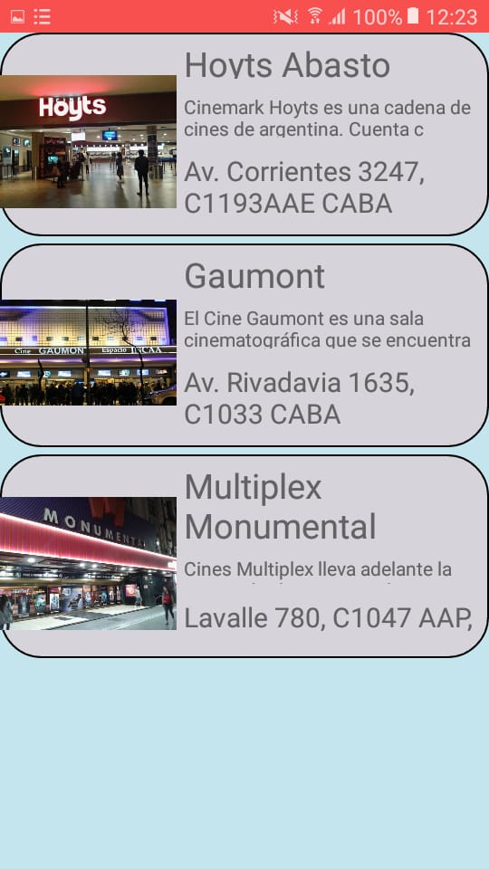
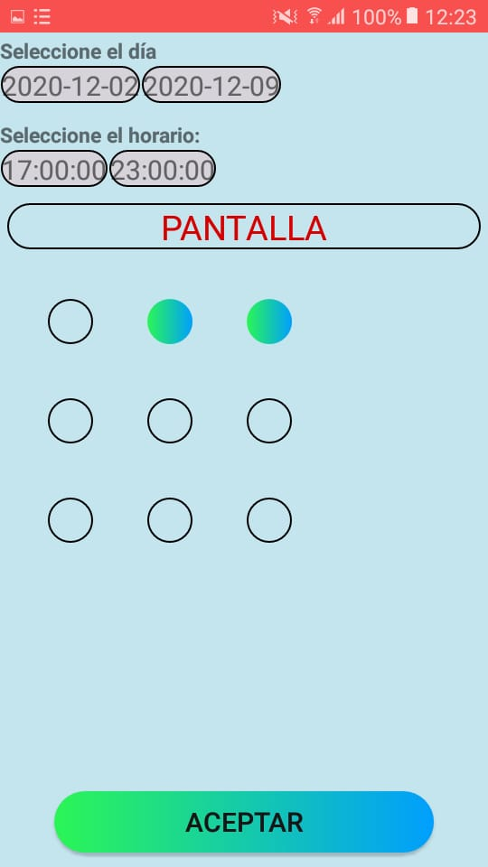
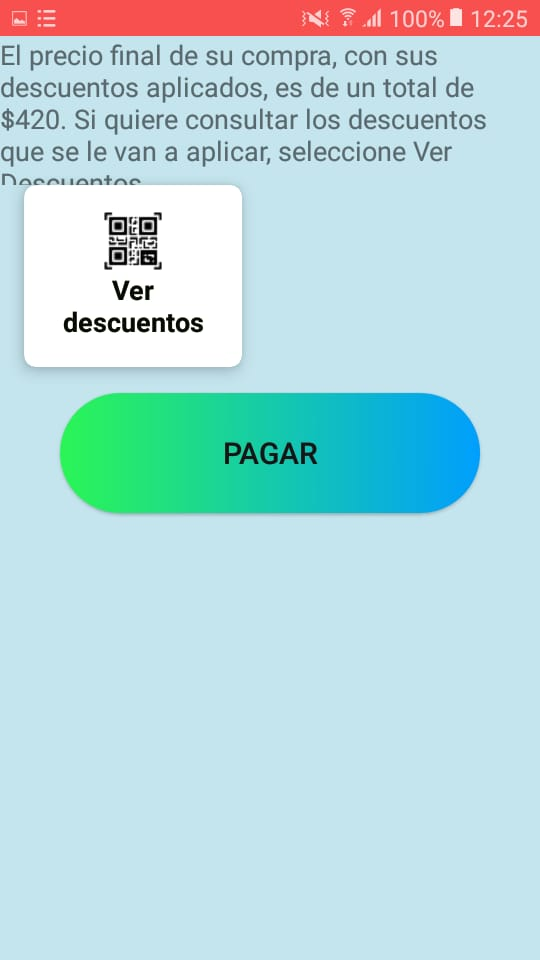
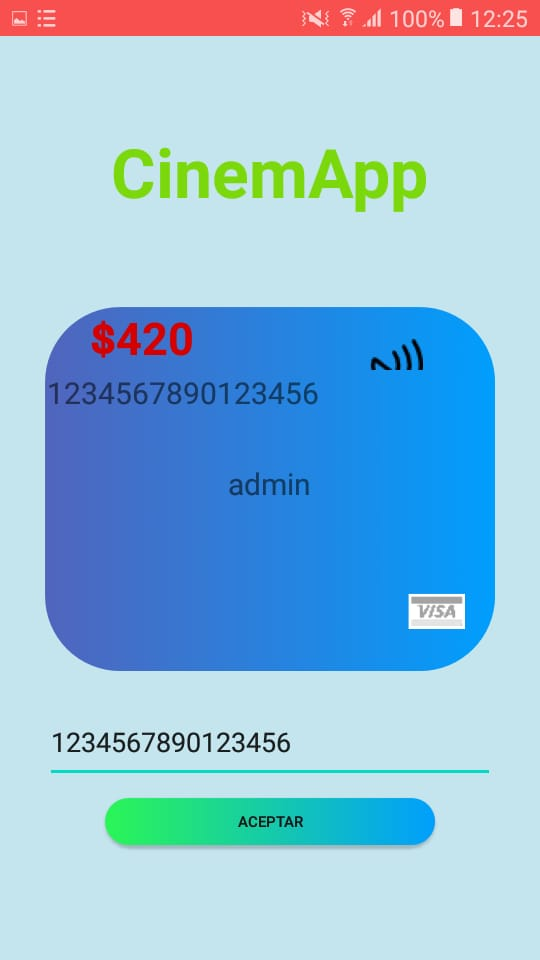

# CinemApp

> **Aplicación para Android** cuyo fin es la de comprar entradas de cine y recibir un código QR como comprobante para entrar al lugar

---

## Imágenes de la App

   
  

---

## Aplicación

Los requerimientos para levantar el proyecto son los siguientes:

* **kotlin**: 1.3.72
* **Sdk**: 30
* **minSdk**: 23
* **Android**: 10 o superior

## Back-end

La aplicación utiliza un backend en Python 3.8 para funcionar cuyo repo se encuentra [aquí](https://github.com/brianwolf/utn-2020-2c-desa-mobile)

Este backend esta desplegado en Heroku para que sea simple de usar, el link esta [aquí](https://utn-2020-2c-desa-mobile.herokuapp.com/)

---

## Autores

Githubs:

* [Brian Lobo](https://github.com/brianwolf)
* [Ezequiel Xifre](https://github.com/e-xifre)
* [Dante Castelluccio](https://github.com/DanteCaste)

Desarrollo de aplicaciones móviles 2C-2020 UTN-FRBA

